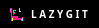
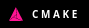
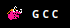
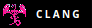
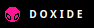

<h1 align="center">Hey there! I'm a screwdriver</h1>
<h2>ready to screw your brains over and over again till eternity! :D</h2>
just kidding! don't close the tab, you can just call me Rellot, Ratatouille or a "Robot"

- I'm aiming to make small indie games with other people or solo
- I'm looking for a little collaboration because I suck at it currently
- I'm secretly working on 2D beat 'em up game(dunno when I announce it)
- Possible 2024 Resolution: 
	- Learn Godot
	- Learn C++ and its various tools
  - Complete 100 days of code challenge
  Fun fact: This new theme is inspired by the [neon art deco](https://en.wikipedia.org/wiki/Miami#Culture_2) which was popularized by [Miami Vice](https://en.wikipedia.org/wiki/Miami_Vice), probably the only cops show with a sense of style and story-telling through music, aired between 1984-1990
 so hopefully people won't get confused by it's theme taken from [blackpink](https://www.youtube.com/channel/UCOmHUn--16B90oW2L6FRR3A)
---

<b>My Skillset</b>

<h2 align="center">My Skillset</h2>

#### Programming Languages:

#### Version Control:

#### Build Systems:

#### Frameworks & Tools:

#### Documentation Generator:

#### Text Editors:

#### Operating System:

---

<b>Click to see my current profile status</b>

<h2>My GitHub Stats</h2>

  
<b><i>NOTE</i></b> : the above data (especially Most Used Languages) does not indicate my skill level or anything like that, it's a github metric of which languages i have the most code on github

---

<h2 align="center">Looking for contribution?</h2>

<h4>If you are looking eyes to contribute my project then check out these top repositories, you can help by improving my code.  Or if you don't want to, can give me some suggestions by opening a new issue. your help is always appreciated
</h4>

  
---
  

  <h2>Contact Information</h2>

