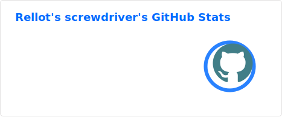
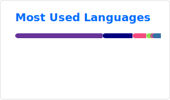

<h1 align="center">Hey there! I'm a screwdriver</h1>
<h2>ready to screw your brains over and over again till eternity! :D</h2>
just kidding! don't close the tab, you can just call me Rellot, Ratatouille or a "Robot"

- I'm aiming to make small indie games with other people or solo
- I'm looking for a little collaboration because I suck at it currently
- I'm secretly working on 2D beat 'em up game(dunno when I announce it)
- 2026 Resolution 
	- Learn Godot and make some few games.
	- Learn QT and make few my own wishlisted apps.
  Fun fact: This theme is inspired by the [neon art deco](https://en.wikipedia.org/wiki/Miami#Culture_2) which was popularized by [Miami Vice](https://en.wikipedia.org/wiki/Miami_Vice)

---

<b>My Skillset</b>

<h2 align="center">My Current Skillset</h2>

| **Languages** |     |
| :--- | :------ |
| **Version Control** |    |
| **Build System** |     |
| **Frameworks** |     |
| **Debugging** |    |
| **Compilers** |    |
| **Doc Generator** |  |
| **Text Editor** |    |
| **Operating System** |    |

---

<b>Click to see my current profile status</b>

<h2>My GitHub Stats</h2>

---

  
<b><i>NOTE</i></b> : the above data (especially Most Used Languages) does not indicate my skill level or anything like that, it's a github metric of which languages i have the most code on github

---

<h2 align="center">Looking for contribution?</h2>

<h4>If you are looking eyes to contribute my project then check out the repo section on top and you can help me by improving my code.  Or if you don't want to, can give me some suggestions by opening a new issue. your help is always appreciated!!
</h4>

  
---
  

  <h2>Contact Information</h2>

